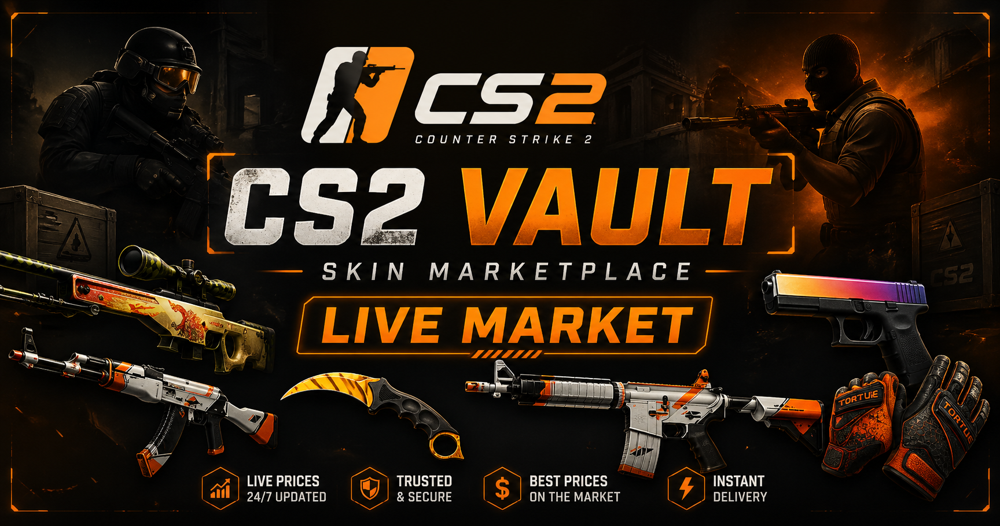

# ⚙️ CS2 VAULT — Backend API

CS2 VAULT backend, Steam Market üzerinden CS2 skin verilerini çeken ve frontend’e sunan ücretsiz bir API servisidir.

---

## 🌐 API URL

👉 https://cs2-market-backend-fg5b.onrender.com/api/skins

---

## ⚙️ Özellikler

- 🔍 Steam Market scraping (ücretsiz, API key yok)
- 🎯 Çoklu arama (ak, awp, knife, vb.)
- 🧹 Gereksiz item filtreleme (case, sticker, graffiti...)
- 🔁 Duplicate (tekrar eden) skin temizleme
- ⚡ Cache sistemi (5 dakika)
- 🚀 Hızlı JSON response

---

## 🧠 Nasıl Çalışır?

Backend, Steam’in şu endpoint’inden veri çeker:

https://steamcommunity.com/market/search/render/

### Veri çekme mantığı:

1. Birden fazla arama yapılır: ak, awp, m4, knife, glove, fade, doppler...

2. Sayfalı veri çekilir: start=0, 100, 200...

3. Gereksiz itemler filtrelenir: case, capsule, sticker, graffiti vs.

4. Aynı skinler (duplicate) silinir

5. Sonuç cache’e alınır (5 dakika)

---
🚀 Kurulum
1. Depoyu klonla
git clone <repo-link>
cd backend
2. Paketleri yükle
npm install
3. Sunucuyu başlat
node index.js

## 📦 API Endpoint

### GET /api/skins

### Örnek Response:

🧪 Kullanılan Teknolojiler
Node.js
Express
node-fetch
CORS

⚠️ Bilinen Sorunlar
Steam bazen rate limit uygular
Fiyatlar her zaman güncel olmayabilir
Tüm skinleri çekmek mümkün değil (Steam limitleri)
Görseller bazen eksik gelebilir

💡 Geliştirme Fikirleri
📊 Fiyat geçmişi
📈 Trend analiz
🔐 API rate limit / key sistemi
🧠 Daha gelişmiş filtreleme
🗄️ Veritabanı entegrasyonu
📌 Not

Bu proje Steam ile resmi olarak bağlantılı değildir.
Eğitim ve geliştirme amaçlıdır.

👤 Author

Ömer Ali Bayrakçı

